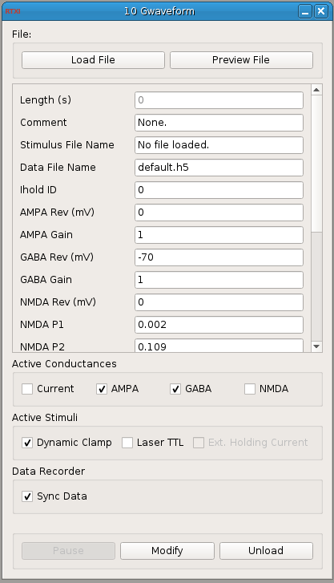

###G-Waveform

**Requirements:** Qwt libraries  
**Limitations:** None  

 

<!--start-->
This module takes an external ASCII formatted file as input. The file should have four columns with units in Amps and Siemens: absolute_current AMPA GABA (NMDA)

There should be one value for each time step and the total length of the stimulus is determined by using the real-time period specified in the System->Control Panel. If you change the real-time period, the length of the trial is recomputed. This module automatically pauses itself when the protocol is complete.

If you are using the Data Recorder, be sure to open the Data Recorder AFTER you open this module or RTXI will crash. This module increments the trial number in the Data Recorder so that each trial will be a separate structure in the HDF5 file. If you do not open the Data Recorder, the module will still run as designed. This module will automatically start and stop the Data Recorder. You must make sure to specify a data filename and select the data you want to save.

Use the checkboxes to select a combination of dynamic clamp stimuli and/or TTL pulses. The dynamic clamp stimuli can be further filtered by using the checkboxes to make only certain conductances (or current) active. The dynamic clamp output and the TTL pulses are on two separate channels and must be assigned to the correct DAQ channels using the System->Connector.

There are both internal and external holding current parameters. The internal one is specified using the 'Holding Current (pA)' field in this module's GUI and is active between repeated trials. When the external holding current is activated using the checkbox, you must provide the instance ID of the correct holding current module in the 'Ihold ID' field. You will probably want to manually start the external Ihold module first. When this dynamic clamp module unpauses, it will pause the Ihold module, and vice versa.
<!--end-->

####Input Channels
1. input(0) - Vm (mV) : Membrane potential

###Output Channels
1. output(0) - Command : Total current
2. output(1) : AMPA Current
3. output(2) : GABA Current
4. output(3) : NMDA Current
5. output(4) : Laser TTL

####Parameters
1. IHold ID - Instance ID of holding current module
2. AMPA Rev (mV) - Reversal potential for AMPA
3. AMPA Gain - Gain by which to multiply AMPA conductance values
4. GABA Rev (mV) - Reversal potential for GABA
5. GABA Gain - Gain by which to multiply GABA conductance values
6. NMDA Rev (mV) - Reversal potential for NMDA
7. NMDA P1
8. NMDA P2
9. NMDA Gain - Gain by which to multiply NMDA conductance values
10. Wait time (s) - Time to wait between trials
11. Holding Current (pA) - Current injected while waiting between trials
12. Laser TTL Duration (s) - Duration of pulse
13. Laser TTL Pulses (#) - Number of pulses
14. Laser TTL Freq (Hz) - Freq. measured between pulse onsets
15. Laser TTL Delay (s) - Time within trial to start pulse train
16. Repeat (#) - Number of trials

####States
1. Length (s) - Length of trial computed from real-time period and file size
2. Time (s)
